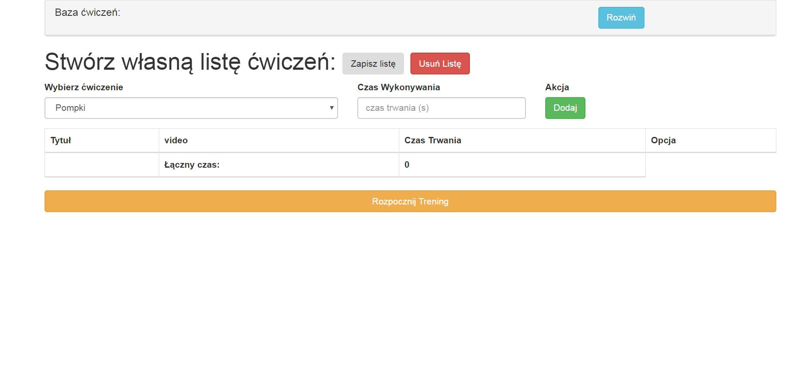
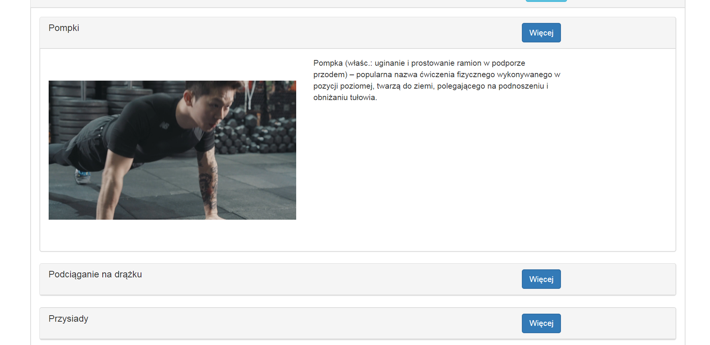
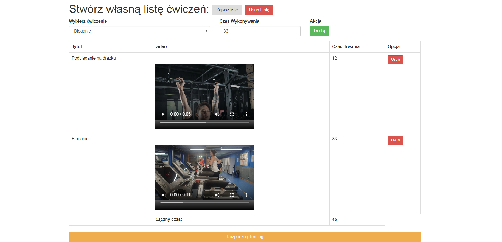
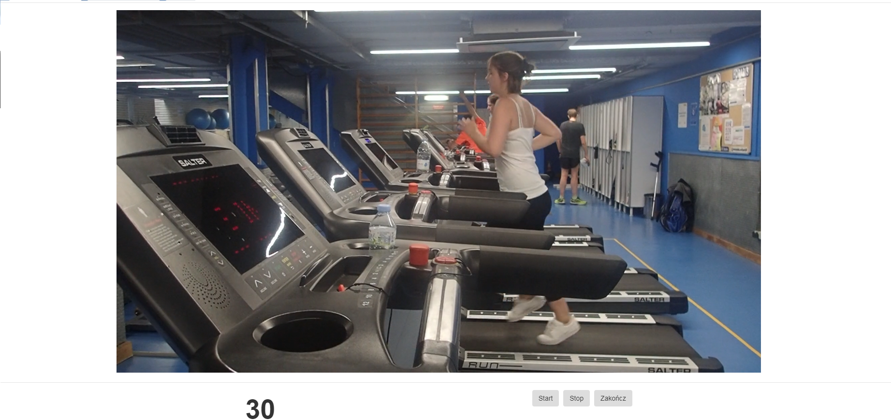

# workout-app 
Application for active people, who want to plan their training.

# Demo : 
https://nolandos.github.io/workout-app/

# Technologies (MERN stack) :
- VanillaJS + OOP + ES6
- localstorage
- bootstrap

# Preview

# Tasks :
`yarn install` to install package
`yarn start` to start project 

<b> ENJOY !</b>
